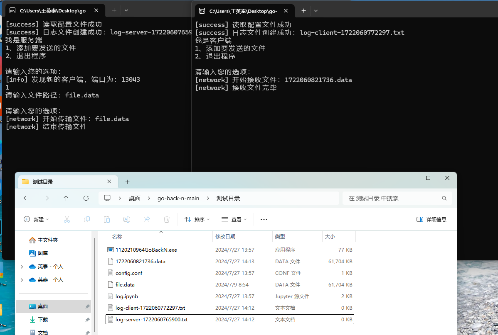

# Reliable file transfer using Go-Back-N protocol

采用GBN（Go-Back-N）协议实现可靠的文件传输。

[项目需求](./Network%20Programming%20Project-1%20Reliable%20file%20transfer%20using%20Go-Back-N%20protocol.pdf)

[实验报告](./实验报告/1120210964王英泰07112102%20GoBackN-项目报告.pdf)

## 🔍目录结构说明

* `GoBackN/`：Visual Studio项目目录，使用VS打开`GoBackN.sln`即可。

* `实验报告/`：实验报告的Word版本、PDF版本和用到的图片和表格。

* `测试目录/`：运行exe程序目录

  * `1120210964GoBackN.exe`：最终生成的可执行程序
  * `config.conf`：可执行程序所需要的配置文件
  * `log.ipynb`：分析日志文件的脚本

* `Network Programming Project-1 Reliable file transfer using Go-Back-N protocol.pdf`：编程作业需求

## 🛠️快速运行

1. 运行`测试目录/`目录下的exe文件。第一次运行的为服务端，绑定到配置文件中指定的端口号，之后运行的为客户端。
2. 为了方便测试，可以将要传输的文件放到同级目录下。在任意一个控制台中按照控制台指示输入命令和要传输文件的路径，按下回车后文件开始传输。在此过程中，会创建日志文件并写入日志。

    

3. 传输结束后，关闭控制台程序。然后打开`log.ipynb`分析生成的日志。
    

## 📒说明

本项目实现了一对主机之间的全双工传输，但并没有实现增强的功能要求中的*多对主机之间的传输*。

